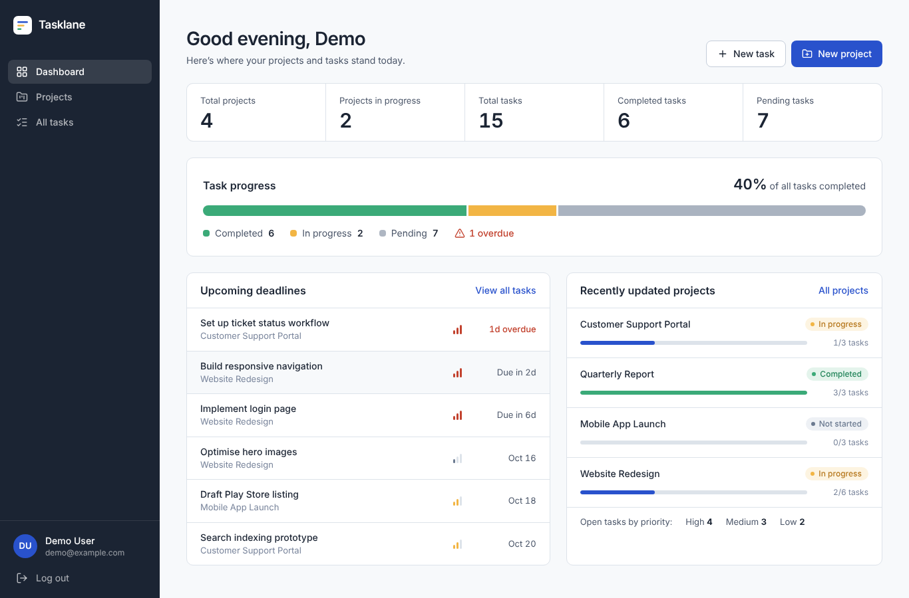
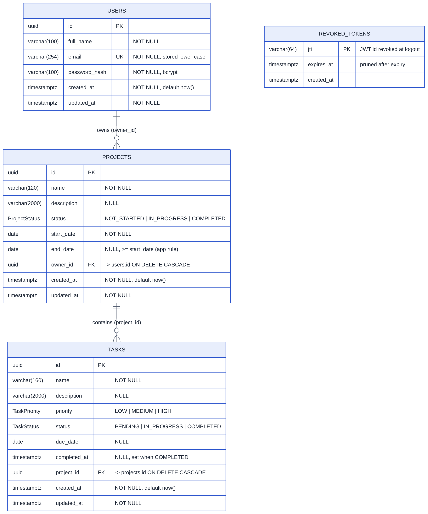
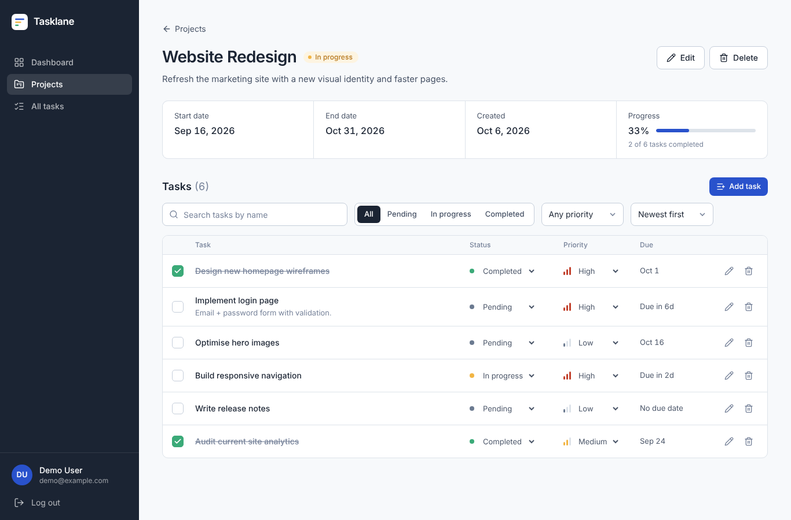
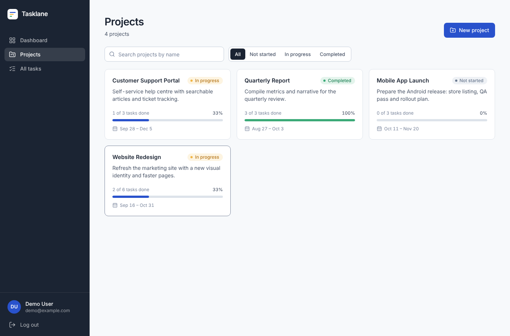
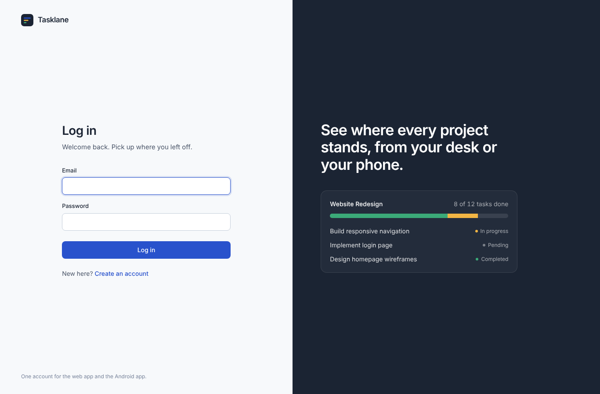
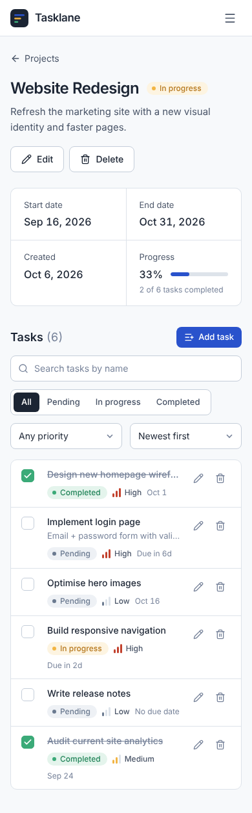
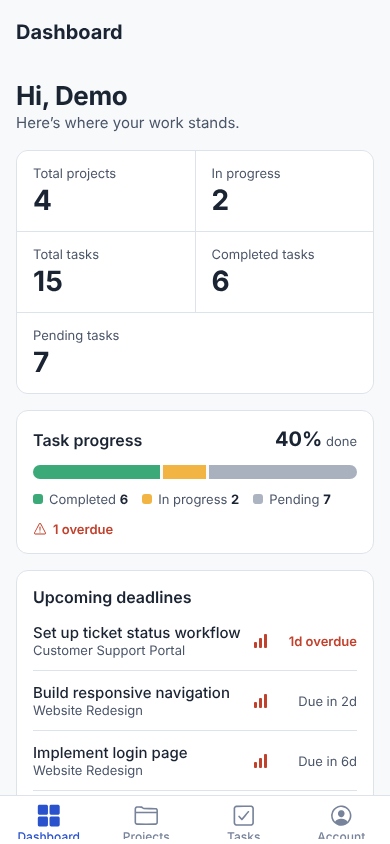
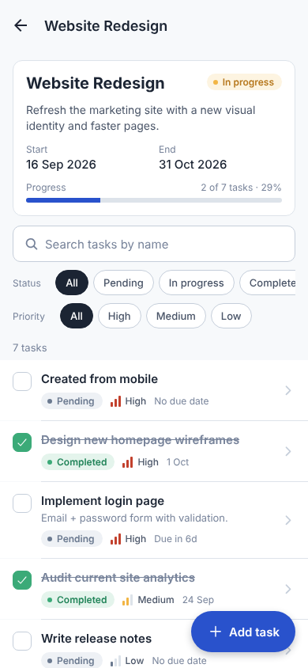
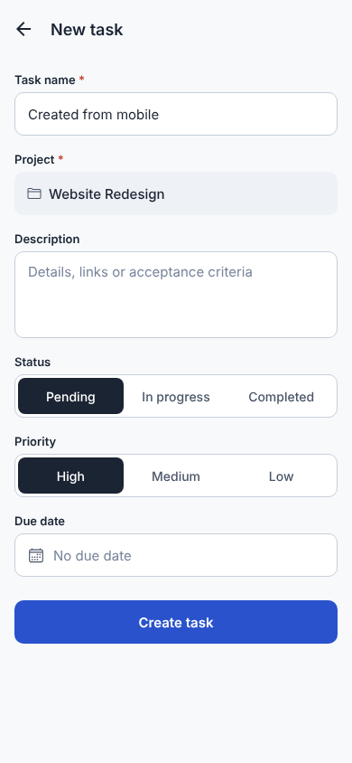
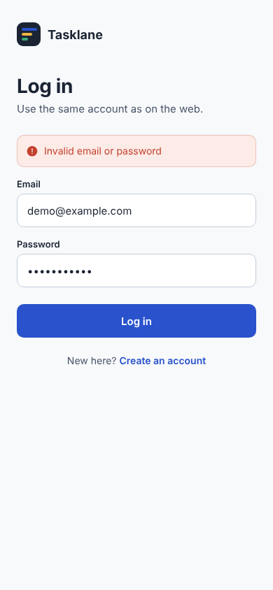

# Tasklane — Project Management System (Web + Android + iOS)

A full-stack project and task manager. A **React web app** and an **Expo (React Native) mobile
app for Android and iOS** share **one Express REST API** and **one PostgreSQL database**, so an account created on
either platform works on the other and every change shows up on both after a refresh.



| Live links | |
|---|---|
| Web app | _add after deploying — see [Deployment](#15-deployment)_ |
| Backend API | _add after deploying_ (`/api/docs` for Swagger UI) |
| Android APK | _add the EAS build link_ |
| iOS build | _add the TestFlight / EAS link (optional)_ |
| Demo video | _add link_ |

---

## Contents
1. [Overview](#1-overview) · 2. [Problem statement](#2-problem-statement) · 3. [Features](#3-features) ·
4. [Architecture](#4-architecture) · 5. [Tech stack](#5-tech-stack) · 6. [Folder structure](#6-folder-structure) ·
7. [Database setup](#7-database-setup) · 8. [Environment variables](#8-environment-variables) ·
9. [Backend setup](#9-backend-setup) · 10. [Web setup](#10-web-setup) · 11. [Mobile setup](#11-mobile-setup) ·
12. [Running locally](#12-running-everything-locally) · 13. [API documentation](#13-api-documentation) ·
14. [Authentication flow](#14-authentication-flow) · 15. [Deployment](#15-deployment) ·
16. [Mobile configuration](#16-mobile-configuration-which-backend-the-app-talks-to) · 17. [Testing](#17-testing) ·
18. [Screenshots](#18-screenshots) · 19. [Security](#19-security-considerations) ·
20. [Design decisions](#20-design-decisions) · 21. [Known limitations](#21-known-limitations)

---

## 1. Overview

Users register, create **projects** (name, description, status, start/end dates), break them
into **tasks** (name, description, priority, status, due date), and follow progress on a
**dashboard**. Projects and tasks can be searched and filtered. Every user only ever sees and
changes their own data.

**Test accounts** (created by `npm run db:seed`, fictional data only):

| Email | Password |
|---|---|
| `demo@example.com` | `Demo@12345` |
| `reviewer@example.com` | `Demo@12345` |

## 2. Problem statement

Build a web application and an Android app that let users manage projects and tasks. Both
apps use the same backend and database, so a user can log in on either one and see and manage
the same projects and tasks — with authentication, per-user authorization, validation,
search/filtering, a statistics dashboard, secure token storage on mobile, and graceful handling
of expired sessions and lost connectivity.

## 3. Features

**Accounts & security** — register, login, logout (server-side token revocation), `GET /auth/me`,
unique case-insensitive email, bcrypt hashing, JWT with expiry, rate-limited auth endpoints.

**Projects** — create, view, edit, delete (with confirmation), list your projects; status
*Not started / In progress / Completed*; start/end/created dates; per-project progress bar;
search by name; filter by status; pagination.

**Tasks** — create, edit, delete, mark completed (one tap), change status and priority inline;
priority *Low / Medium / High*; status *Pending / In progress / Completed*; due dates with
"due in 2d / overdue" hints; search by name; filter by status and priority; sorting; pagination.

**Dashboard** — total projects, total tasks, completed tasks, pending tasks, projects in
progress, plus completion rate, overdue count, upcoming deadlines and recently updated projects.
Always computed live for the logged-in user.

**Web app** — responsive (phone → desktop), protected routes, form validation that mirrors the
backend, server errors mapped onto form fields, loading skeletons, empty and error states with
retry, confirmation dialogs, toasts, offline banner, filters kept in the URL, refetch on tab focus.

**Mobile app (Android + iOS, one codebase)** — login/register/logout, dashboard, projects, project tasks, all-tasks view,
create/edit/delete tasks, tick to complete, change status/priority from the list, task search
and status/priority filters, pull-to-refresh everywhere, token in SecureStore (Android Keystore),
"session expired" handling, offline banner and friendly no-connection screens.
Platform-native details: iOS action sheets and Android dialogs for quick status/priority
changes, inline iOS calendar vs. Android date dialog, iOS sheet with Cancel for the task form,
Keychain (iOS) / Keystore (Android) token storage.

**Bonus** — integration tests (51), pagination, sorting, Swagger/OpenAPI docs, Docker Compose,
GitHub Actions CI, server-side token revocation (denylist), structured request logging.

## 4. Architecture

```
┌──────────────────────┐        ┌──────────────────────┐
│  Web app (React/Vite)│        │ Mobile app (Expo RN) │
│  token: localStorage │        │ Android + iOS        │
│                      │        │ token: SecureStore   │
└──────────┬───────────┘        └──────────┬───────────┘
           │  HTTPS + JSON, Authorization: Bearer <JWT>
           └───────────────┬───────────────┘
                           ▼
            ┌──────────────────────────────┐
            │  Express API  (/api/*)       │
            │  helmet · CORS · rate limit  │
            │  pino logging · zod validate │
            │  JWT auth middleware         │
            │  controllers → services      │
            └──────────────┬───────────────┘
                           │ Prisma ORM (parameterized SQL)
                           ▼
            ┌──────────────────────────────┐
            │  PostgreSQL                  │
            │  users ─1:N─ projects ─1:N─ tasks
            └──────────────────────────────┘
```

Request path inside the API: `route → authenticate (JWT + revocation check) → controller (parse &
validate input with zod) → service (business rules, ownership-scoped Prisma queries) →
serializer (whitelisted fields) → JSON envelope`. All errors flow to one centralised handler.

## 5. Tech stack

| Layer | Choice |
|---|---|
| Backend | Node.js 22, Express 5, TypeScript, Prisma 7 (with `@prisma/adapter-pg`), Zod, jsonwebtoken, bcryptjs, Helmet, cors, express-rate-limit, pino / pino-http, swagger-ui-express |
| Database | PostgreSQL 16 with Prisma migrations |
| Web | React 19, Vite, TypeScript, React Router 7, TanStack Query 5, Axios, React Hook Form + Zod, Tailwind CSS 4, Sonner (toasts), Lucide icons |
| Mobile | Expo SDK 57, React Native 0.86, TypeScript, Expo Router, TanStack Query 5, expo-secure-store, @react-native-community/netinfo, @react-native-community/datetimepicker |
| Tests | Vitest + Supertest (API integration tests against a real PostgreSQL test DB) |
| Deploy | Render (API), Neon (Postgres), Vercel (web), Expo EAS (Android APK, iOS simulator build / TestFlight); Docker Compose; GitHub Actions CI |

## 6. Folder structure

```
project-management-system/
├── backend/
│   ├── prisma/
│   │   ├── schema.prisma           # User, Project, Task, RevokedToken
│   │   ├── migrations/             # SQL migrations (committed)
│   │   └── seed.ts                 # test data only
│   ├── src/
│   │   ├── config/                 # env validation, logger, prisma client
│   │   ├── controllers/            # HTTP layer: parse input → call service → respond
│   │   ├── middleware/             # authenticate, rate limiters, error handler
│   │   ├── routes/                 # route table
│   │   ├── services/               # business logic, ownership-scoped queries
│   │   ├── validators/             # zod schemas
│   │   ├── utils/                  # AppError, jwt, serializers, dates, response
│   │   ├── app.ts                  # express app factory (used by tests)
│   │   └── server.ts               # starts the HTTP server
│   ├── tests/                      # integration tests (auth, projects, tasks, dashboard)
│   ├── openapi.yaml                # OpenAPI 3 spec (served at /api/docs)
│   ├── prisma.config.ts · Dockerfile · .env.example · .env.test
├── web/
│   └── src/
│       ├── components/  (ui/ primitives, TaskBoard, TaskList, forms…)
│       ├── pages/       (Login, Register, Dashboard, Projects, ProjectDetail, Tasks)
│       ├── layouts/     (AppLayout with sidebar, AuthLayout)
│       ├── hooks/       (React Query hooks, URL state, debounce, online status)
│       ├── services/    (axios client, endpoints)
│       ├── context/     (AuthContext)
│       ├── types/ · utils/
├── mobile/
│   ├── app/                        # Expo Router routes (= navigation)
│   │   ├── _layout.tsx             # providers + protected stack
│   │   ├── (tabs)/                 # Dashboard, Projects, Tasks, Account tabs
│   │   ├── project/[id].tsx · task-form.tsx · login.tsx · register.tsx
│   ├── src/
│   │   ├── screens/ · components/ · services/ (api, secureSession, config)
│   │   ├── hooks/ · context/ · types/ · utils/ · theme.ts
│   ├── app.json · eas.json · .env.example
├── docs/
│   ├── API.md · ER_DIAGRAM.md · er-diagram.svg/png · DEPLOYMENT.md
│   ├── DEMO_SCRIPT.md · REQUIREMENTS_AUDIT.md · screenshots/
├── docker-compose.yml · render.yaml · .github/workflows/ci.yml
└── README.md
```

In the mobile app the route files in `app/` are one-line re-exports of the screens in
`src/screens/`, so navigation (`app/`) and screen code (`src/screens/`) stay separate.

## 7. Database setup

Schema, relationships, normalisation and indexes: **[docs/ER_DIAGRAM.md](docs/ER_DIAGRAM.md)**.



You need PostgreSQL 14+ — pick one:

```bash
# A) Docker (simplest)
docker run --name pms-db -e POSTGRES_PASSWORD=postgres -e POSTGRES_DB=pms -p 5432:5432 -d postgres:16

# B) Local install: create the databases
createdb pms
createdb pms_test        # only needed to run the tests

# C) Hosted (Neon/Supabase): copy its connection string into DATABASE_URL
```

Then from `backend/`:

```bash
npx prisma migrate deploy   # create tables from prisma/migrations
npm run db:seed             # optional: test accounts + sample projects/tasks
```

During development, `npm run db:migrate` (`prisma migrate dev`) creates new migrations after
schema changes; `npm run db:reset` drops and recreates the database.

## 8. Environment variables

### Backend — `backend/.env` (template: `backend/.env.example`)

| Variable | Required | Default | Description |
|---|---|---|---|
| `DATABASE_URL` | ✅ | — | PostgreSQL connection string |
| `JWT_SECRET` | ✅ | — | Secret for signing JWTs, **min 32 chars** (the server refuses to start otherwise) |
| `JWT_EXPIRES_IN` | | `7d` | Login lifetime (`15m`, `12h`, `7d`) |
| `CORS_ORIGIN` | | `http://localhost:5173` | Comma-separated web origins allowed to call the API |
| `PORT` | | `4000` | HTTP port |
| `NODE_ENV` | | `development` | `development` \| `production` \| `test` |
| `BCRYPT_SALT_ROUNDS` | | `12` | bcrypt cost |
| `AUTH_RATE_LIMIT_MAX` | | `10` | Failed logins / registrations per IP per 15 min |
| `TRUST_PROXY` | | `0` | Set `1` behind Render/Railway/Nginx so rate limiting sees real IPs |
| `LOG_LEVEL` | | `info` | pino log level |

`backend/.env.test` holds **non-secret** values for the test database and is committed on purpose.

### Web — `web/.env.local` (template: `web/.env.example`)

| Variable | Description |
|---|---|
| `VITE_API_URL` | Backend base URL incl. `/api`. Defaults to `http://localhost:4000/api` in dev. **Set it for production builds.** |

### Mobile — `mobile/.env.local` (template: `mobile/.env.example`) or `eas.json`

| Variable | Description |
|---|---|
| `EXPO_PUBLIC_API_URL` | Backend base URL incl. `/api`. Unset in dev → uses your laptop's LAN IP automatically. Set in `eas.json` for APK builds. |

Real secrets are never committed (`.env` files are git-ignored).

## 9. Backend setup

```bash
cd backend
npm install
cp .env.example .env          # then set DATABASE_URL and JWT_SECRET
npx prisma generate           # generate the typed client (also runs automatically before dev/test/build)
npx prisma migrate deploy
npm run db:seed               # optional test data
npm run dev                   # http://localhost:4000/api  ·  docs: http://localhost:4000/api/docs
```

Production build: `npm run build && npm run start:prod` (applies migrations, then starts).

## 10. Web setup

```bash
cd web
npm install
cp .env.example .env.local    # VITE_API_URL=http://localhost:4000/api
npm run dev                   # http://localhost:5173
npm run build                 # production build in web/dist
```

## 11. Mobile setup

Requirements: Node 20+ and one of:
- **Android:** the **Expo Go** app (Play Store) on a phone, or an Android emulator (Android Studio).
- **iOS:** the **Expo Go** app (App Store) on an iPhone — works from Windows/Linux/macOS, no Apple
  account needed — or the iOS Simulator (macOS with Xcode only).

```bash
cd mobile
npm install
npx expo start               # Android: scan the QR code in Expo Go, or press "a" for the emulator
                             # iOS: scan the QR code with the Camera app (opens Expo Go), or press "i" for the Simulator (Mac)
```

- Phone + laptop on the same Wi-Fi: no configuration needed — in development the app calls
  `http://<your-laptop-IP>:4000/api`. Allow port 4000 through your firewall.
- To use the deployed backend instead: create `mobile/.env.local` with
  `EXPO_PUBLIC_API_URL=https://<your-backend>.onrender.com/api` and run `npx expo start -c`.
- Install packages with `npx expo install <pkg>` so versions match the Expo SDK.

## 12. Running everything locally

Three terminals:

```bash
# 1 — API (needs PostgreSQL running)
cd backend && npm run dev
# 2 — Web
cd web && npm run dev            # open http://localhost:5173
# 3 — Mobile
cd mobile && npx expo start      # open in Expo Go / emulator
```

Log in on both with `demo@example.com` / `Demo@12345` (after seeding), or register a new account
on either one.

Alternative for steps 1: `docker compose up --build` starts PostgreSQL + API together.

## 13. API documentation

- **Full reference with examples:** [docs/API.md](docs/API.md)
- **Swagger UI:** `http://localhost:4000/api/docs` (spec: `backend/openapi.yaml`, JSON at `/api/openapi.json`)

| Method | Endpoint | Auth | Purpose |
|---|---|---|---|
| POST | `/api/auth/register` | — | Create account → token |
| POST | `/api/auth/login` | — | Log in → token |
| POST | `/api/auth/logout` | ✅ | Revoke current token |
| GET | `/api/auth/me` | ✅ | Current user |
| GET | `/api/projects` | ✅ | List own projects (`search`, `status`, `sortBy`, `order`, `page`, `limit`) |
| GET | `/api/projects/:id` | ✅ | One project (+ task counts, progress) |
| POST | `/api/projects` | ✅ | Create project |
| PUT | `/api/projects/:id` | ✅ | Update project (partial) |
| DELETE | `/api/projects/:id` | ✅ | Delete project and its tasks |
| GET | `/api/tasks` | ✅ | List own tasks (`projectId`, `search`, `status`, `priority`, `sortBy`, `order`, `page`, `limit`) |
| GET | `/api/tasks/:id` | ✅ | One task |
| POST | `/api/tasks` | ✅ | Create task in an owned project |
| PUT | `/api/tasks/:id` | ✅ | Update task (partial) — status, priority, complete… |
| DELETE | `/api/tasks/:id` | ✅ | Delete task |
| GET | `/api/dashboard` | ✅ | Statistics for the current user |
| GET | `/api/health` | — | Health check (DB ping) |

Example: `GET /api/tasks?search=login&status=PENDING&priority=HIGH`

## 14. Authentication flow

1. **Register / login** → the API validates input, hashes (register) or verifies (login) the
   password with bcrypt, and returns `{ token, expiresAt, user }`. The JWT carries the user id
   (`sub`), a unique token id (`jti`), issuer/audience and `exp`.
2. **Storing the token**
   - Web: `localStorage` (so the session survives browser restarts until logout/expiry).
   - Android: **Expo SecureStore** → encrypted with a key in the **Android Keystore**.
3. **Every request** sends `Authorization: Bearer <token>`. The `authenticate` middleware checks
   signature, algorithm (HS256 only), issuer, audience, expiry, that the token id is not revoked,
   and that the user still exists.
4. **Expiry** — the API answers `401` with `code: "TOKEN_EXPIRED"`. Both clients then clear the
   session and return to login with *"Your session has expired. Please log in again."* They also
   schedule a timer for `expiresAt` (and the app re-checks when it returns to the foreground), so
   an idle session ends on time too.
5. **Logout** → `POST /auth/logout` stores the token id in `revoked_tokens` until it would have
   expired; the client wipes its stored token and cached data. Logging out on the web does not
   log out the phone (separate tokens).
6. **One account everywhere** — both apps call the same endpoints against the same database.

## 15. Deployment

Step-by-step guide (Neon → Render → Vercel → EAS): **[docs/DEPLOYMENT.md](docs/DEPLOYMENT.md)**.

Summary:

| Part | Where | Key settings |
|---|---|---|
| DB | Neon | copy connection string |
| API | Render (`render.yaml` blueprint or manual) | root `backend`, build `npm ci --include=dev && npm run build`, start `npm run start:prod`, env `DATABASE_URL`, `JWT_SECRET`, `CORS_ORIGIN=<vercel url>`, `TRUST_PROXY=1` |
| Web | Vercel | root `web`, env `VITE_API_URL=https://<api>/api` |
| Android | Expo EAS | set `EXPO_PUBLIC_API_URL` in `mobile/eas.json`, then `npm run build:apk` |
| iOS | Expo EAS | same `eas.json` URL, then `npm run build:ios-simulator` (free) or `npm run build:ios-testflight` (Apple Developer account) |

Nothing hard-codes `localhost` in production: the API reads all settings from env vars, the web
build reads `VITE_API_URL`, and the APK reads `EXPO_PUBLIC_API_URL` from `eas.json`.

## 16. Mobile configuration (which backend the app talks to)

| Situation | Set |
|---|---|
| APK / production | `mobile/eas.json` → `build.preview.env.EXPO_PUBLIC_API_URL = "https://<api>.onrender.com/api"` |
| Expo Go → deployed backend | `mobile/.env.local`: `EXPO_PUBLIC_API_URL=https://<api>.onrender.com/api` then `npx expo start -c` |
| Expo Go → backend on your laptop | leave unset (auto-detects laptop IP) |
| Android emulator → laptop | `http://10.0.2.2:4000/api` (also the automatic fallback) |
| iOS Simulator → laptop (Mac) | `http://localhost:4000/api` (also the automatic fallback) |
| iOS build (Simulator / TestFlight) | same `EXPO_PUBLIC_API_URL` in `eas.json` as the APK |

The **Account** tab shows the URL the app is using. Android and iOS release builds require `https://`
(iOS App Transport Security only allows plain HTTP on the local network).

Building the APK:

```bash
cd mobile
npx eas-cli@latest login
npx eas-cli@latest init
npm run build:apk        # eas build -p android --profile preview  → .apk download link
```

Building for iOS (details in [docs/DEPLOYMENT.md §5](docs/DEPLOYMENT.md#5-ios-app--expo-eas)):

```bash
npm run build:ios-simulator   # free: .app for the iOS Simulator (no Apple Developer account)
npm run build:ios             # install on registered iPhones (Apple Developer Program, $99/yr)
npm run build:ios-testflight  # build + upload to TestFlight (Apple Developer Program)
```

## 17. Testing

```bash
cd backend
# needs a PostgreSQL database named pms_test (see backend/.env.test)
createdb pms_test     # once
npm test
```

51 integration tests run the real Express app against a real PostgreSQL database (wiped between
tests). The suite refuses to run against a database whose name does not contain `test`.

| Area | What's covered |
|---|---|
| Auth | register, bcrypt hash stored (no plain text), duplicate email (case-insensitive) → 409, invalid email / missing fields / weak password → 422, malformed JSON → 400, login, wrong password and unknown email give the same 401, login rate limit → 429, no token / tampered token / **expired token** → 401, `/me`, logout revokes the token, logout on one device doesn't affect another |
| Projects | create (defaults, trimming), list only own + pagination, read with progress, partial update, delete cascades tasks, **other user gets 404 on read/update/delete**, `ownerId` in body ignored, search + status filter + sort, invalid enum, invalid/impossible dates, end before start (incl. partial update), empty update, malformed id |
| Tasks | create with defaults, read, list by project, status/priority update + `completedAt`, clear fields, delete, **IDOR: other user's task 404**, can't create in or move into another user's project, non-existent project → 404, blank name / bad projectId / bad enums / bad due date → 422, search + status + priority filters, sort by priority, invalid filter → 400 |
| Dashboard | zeros for new user, correct counts scoped to the user, updates after a change |
| Platform | JSON 404 for unknown routes, Helmet headers, CORS allows only configured origins |

Also: `npm run typecheck` (backend), `npm run build` (web, includes `tsc`), `npm run typecheck`
(mobile). CI runs all of them on every push (`.github/workflows/ci.yml`).

## 18. Screenshots

| Web — dashboard | Web — project details |
|---|---|
|  |  |

| Web — projects | Web — login | Web on a phone |
|---|---|---|
|  |  |  |

| Mobile — dashboard | Mobile — project tasks | Mobile — task form | Mobile — no connection |
|---|---|---|---|
|  |  |  |  |

_Mobile screenshots were captured from the same React Native code rendered in a phone-sized
browser; replace them with screenshots from your Android device after building the APK._

## 19. Security considerations

| Threat | Mitigation |
|---|---|
| Password theft from DB | bcrypt (cost 12); plain text never stored or logged; hashes never returned |
| Brute force | Login: 10 failed attempts / IP / 15 min; register limited too; global API limit |
| User enumeration | Same 401 message for unknown email and wrong password; dummy bcrypt compare equalises timing |
| Token forgery / misuse | HS256 only (no `alg` switching), issuer + audience checked, expiry enforced, ≥32-char secret enforced at boot |
| Token reuse after logout | `jti` denylist checked on every request |
| IDOR / horizontal privilege escalation | Every query includes the owner (`ownerId = userId`, tasks via `project.ownerId`); updates/deletes use ownership in the `WHERE` clause; other users' ids return 404 |
| Mass assignment | Zod schemas whitelist fields; `ownerId` comes only from the token |
| SQL injection | Prisma ORM parameterized queries only; no string-built SQL |
| Invalid input | Zod validation on every body, query and id (types, required, empty strings, email, dates incl. impossible dates, enums, lengths, cross-field rules); 100 KB body limit |
| Leaking internals | Serializers whitelist response fields; 500s return a generic message; stack traces only in logs; auth headers redacted in logs |
| Cross-origin abuse | CORS allow-list from `CORS_ORIGIN` |
| Browser hardening | Helmet headers on the API; security headers on the Vercel site |
| Token theft on mobile | SecureStore (Android Keystore / iOS Keychain), `WHEN_UNLOCKED_THIS_DEVICE_ONLY` (iOS: never synced to iCloud or restored to another device) |
| Insecure transport (iOS) | App Transport Security: HTTPS required except on the local network |
| Stale data across accounts | Query caches cleared on login/logout on both clients |

## 20. Design decisions

- **Express + layered architecture** (routes → controllers → services) — small, explicit, easy to
  explain; services hold all ownership rules so controllers stay thin.
- **Prisma 7 with the `pg` driver adapter** — type-safe queries, committed SQL migrations, and no
  native query-engine binary in production.
- **404 instead of 403 for other users' resources** — avoids confirming that an id exists (OWASP
  recommendation for IDOR). `403` is reserved in the error model but no current route needs it.
- **400 vs 422** — 400 for malformed requests (bad JSON, bad id, bad query param); 422 for a
  well-formed body that fails validation, with per-field `errors`.
- **`PUT` accepts partial bodies** — the clients change one field at a time (status, priority,
  complete); requiring the full object would invite lost updates between web and mobile.
- **Dates as `YYYY-MM-DD` / PostgreSQL `DATE`** — a due date is a calendar day, not an instant, so
  time zones can't shift it.
- **Task ownership derived through the project** — no duplicated `owner_id` on tasks (3NF).
- **Stateless JWT + small revocation table** — real logout without the complexity of refresh tokens.
- **Web token in `localStorage`** — meets "stay logged in until logout or expiry" across a
  separate API domain without third-party-cookie problems; XSS risk is reduced by React's escaping,
  no `dangerouslySetInnerHTML`, and strict security headers. (httpOnly cookies would need the web
  and API on the same site.)
- **TanStack Query on both clients** — caching, refetch on focus (web) and invalidation after
  every mutation keep the dashboard, lists and progress in sync.
- **Mobile without a separate backend** — the app calls exactly the same endpoints as the web app.
- **UI** — one visual language on both clients ("Tasklane"): cool neutrals, one cobalt action
  colour, three consistent status colours, priority shown as 1–3 bars so it doesn't rely on colour.

## 21. Known limitations

- No refresh tokens: when the access token expires (default 7 days) the user logs in again.
- No real-time sync: the other client sees a change after a refresh / pull-to-refresh / tab focus
  (as the brief specifies), not instantly via websockets.
- The mobile app manages tasks and views projects; creating/editing/deleting **projects** is done
  on the web (the brief's mobile scope covers tasks). The API supports it, so adding it is UI-only.
- No offline editing on mobile; offline, the app shows cached data where available and a clear
  "you're offline" message.
- No password reset / email verification (out of scope).
- Render's free tier sleeps when idle, so the first request after a while is slow.
- iOS: the app bundles for iOS and its native project generates correctly, but in this build
  environment it was not run on a physical iPhone or the Simulator — do one pass in Expo Go on an
  iPhone before recording. Installing a build on real iPhones (outside Expo Go) needs a paid
  Apple Developer account.
- The Docker setup is provided for convenience; the primary documented path is Node + PostgreSQL.
