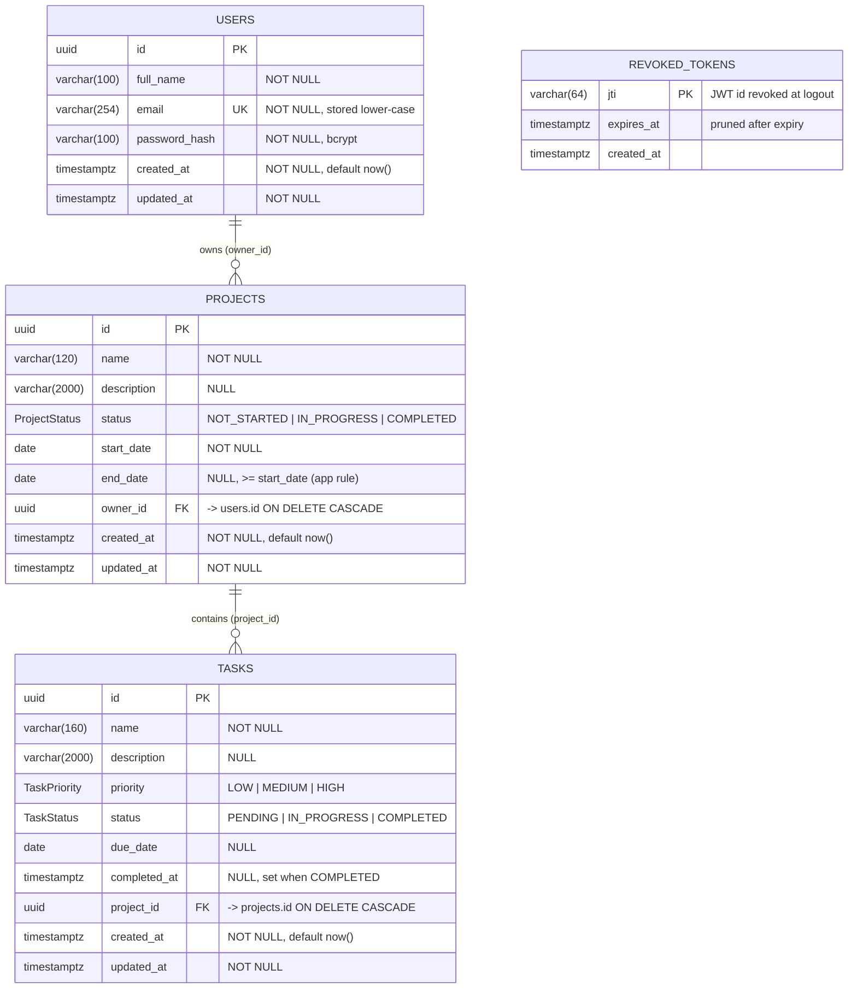

# Database schema & ER diagram

PostgreSQL, managed with Prisma migrations (`backend/prisma/schema.prisma`,
`backend/prisma/migrations/`). A rendered image is in
[`er-diagram.svg`](./er-diagram.svg) / [`er-diagram.png`](./er-diagram.png).

## Relationships

| Relationship | Cardinality | Foreign key | On delete |
|---|---|---|---|
| User → Project | 1 : N | `projects.owner_id → users.id` | CASCADE (deleting a user removes their projects) |
| Project → Task | 1 : N | `tasks.project_id → projects.id` | CASCADE (deleting a project removes its tasks) |

`revoked_tokens` is a standalone denylist (no FK): it stores only the token id
and its expiry so logout is enforced server-side.

## Normalisation

- **1NF** – every column is atomic; no repeating groups (tasks are rows, not a list column).
- **2NF / 3NF** – single-column surrogate keys; every non-key column depends only on its own
  row's key. A task's owner is **not** duplicated on the task: it is derived through
  `tasks.project_id → projects.owner_id`, so ownership has a single source of truth.
- Status and priority are PostgreSQL **enum types**, so invalid values are rejected by the
  database as well as by the API.

## Indexes

| Index | Why |
|---|---|
| `users_email_key` (UNIQUE) | Unique email + fast login lookup |
| `projects (owner_id, status)` | "My projects", filter by status, dashboard counts |
| `projects (owner_id, created_at)` | "My projects" sorted by date |
| `tasks (project_id, status)` | Tasks of a project, status filter, dashboard counts |
| `tasks (project_id, priority)` | Priority filter |
| `tasks (due_date)` | Upcoming / overdue queries, sort by due date |
| `revoked_tokens (expires_at)` | Pruning expired entries |

Foreign keys (`owner_id`, `project_id`) are the leading column of the composite indexes, so
join/filter lookups by owner or project are covered.
